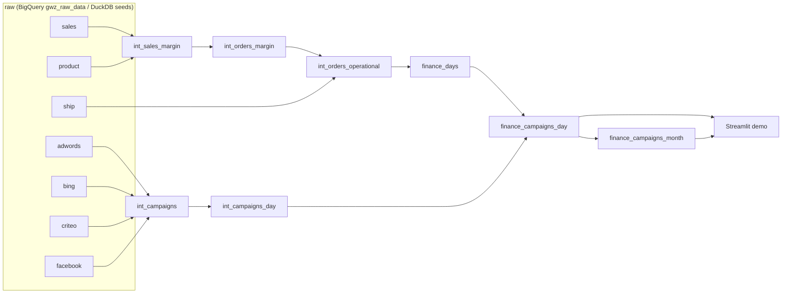

# Greenweez Finance and Campaign Analytics

dbt project that models transactional finance data together with paid-campaign data, so margin, logistics costs and advertising impact can be read from one reporting layer. It runs on **BigQuery** (the real warehouse) and on **DuckDB** (synthetic seed data, used by CI and the local demo).

## Business framing

- How much operational margin is generated after logistics costs?
- How does ad spend affect daily and monthly profitability?
- Which reporting models connect revenue, cost and campaign performance cleanly?

## Architecture



| Layer | Models | Materialization |
|---|---|---|
| staging | `stg_raw__sales`, `__product`, `__ship`, `__adwords`, `__bing`, `__criteo`, `__facebook` | view |
| intermediate | `int_sales_margin`, `int_orders_margin`, `int_orders_operational`, `int_campaigns`, `int_campaigns_day` | view |
| mart (`finance` dataset) | `finance_days`, `finance_campaigns_day` (view), `finance_campaigns_month` | table |

Key metric definitions:

- `operational_margin = margin + shipping_fee - log_cost - ship_cost`. Missing shipping records count as 0 (flagged by `has_ship_record`), so an order never drops out of the totals.
- `ads_margin = operational_margin - ads_cost`. Days with ad spend but no orders are kept and show a negative margin.
- Monthly `average_basket` is weighted (`sum(revenue) / sum(transactions)`), not an average of daily averages.

## Quick start (DuckDB demo, no cloud account needed)

```bash
make setup     # pip install -r requirements.txt && dbt deps
make build     # dbt seed + dbt build (models, tests, unit tests) -> target/demo.duckdb
make demo      # Streamlit dashboard on top of the marts
make docs      # dbt docs (lineage incl. the dashboard exposure)
make lint      # sqlfluff + yamllint
```

`scripts/generate_seed_data.py` regenerates the synthetic raw tables in `seeds/` (deterministic). It deliberately includes edge cases: orders without a shipping row, a sold product missing from the product table, days with ad spend but no orders. The two `WARN` results in `dbt build` come from these cases on purpose.

Note: dbt sources do not create DAG edges to seeds, so load them first (`dbt seed`) and then `dbt build --exclude resource_type:seed`; `make build` does this.

## Running against BigQuery

1. Copy `.github/dbt-profiles/profiles.bigquery.example.yml` to `~/.dbt/profiles.yml` and set your project/dataset.
2. `dbt deps && dbt build`. Seeds are disabled on the BigQuery target; sources resolve to `workintech-working.gwz_raw_data.raw_gz_*`.
3. Marts are written to a dataset literally named `finance` (see `macros/generate_schema_name.sql`).

The BigQuery target parses without credentials, but CI does not execute it (that needs a service account).

## Quality checks (CI)

`.github/workflows/ci.yml` runs on every PR: `yamllint`, `sqlfluff lint`, `dbt deps`, `dbt seed`, `dbt build` on DuckDB (about 70 data tests, singular tests in `tests/`, unit tests for the margin and weighted-basket logic), and uploads the dbt docs as an artifact.

## Layout

```
models/{staging,intermediate,mart/finance}   dbt models + schema.yml docs/tests
models/exposures.yml                         dashboard exposure
macros/                                      stg_ads_source, month_start, generate_schema_name
seeds/                                       synthetic raw_gz_* CSVs (DuckDB targets only)
tests/                                       singular reconciliation tests
demo/app.py                                  Streamlit dashboard (reads target/demo.duckdb)
scripts/generate_seed_data.py                seed generator
```

## Limitations

- The demo data is synthetic; its numbers say nothing about the real Greenweez business.
- Campaign performance is reporting logic, not production marketing attribution.
- The dashboard is a demo, not a BI product.
- BigQuery execution is not part of CI.

## License

MIT
