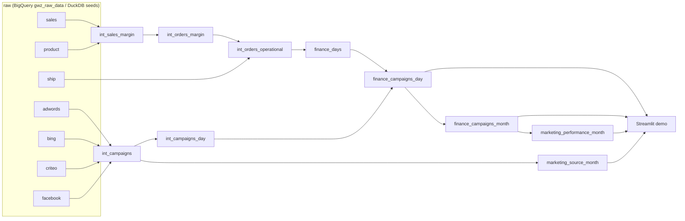

# Greenweez Finance and Campaign Analytics

dbt project that models transactional finance data together with paid-campaign data, so margin, logistics costs and advertising impact can be read from one reporting layer. It runs on **BigQuery** (the real warehouse) and on **DuckDB** (synthetic seed data, used by CI and the local demo).

## Business framing

- How much operational margin is generated after logistics costs?
- How does ad spend affect daily and monthly profitability?
- Which reporting models connect revenue, cost and campaign performance cleanly?

## Architecture



| Layer | Models | Materialization |
|---|---|---|
| staging | `stg_raw__sales`, `__product`, `__ship`, `__adwords`, `__bing`, `__criteo`, `__facebook` | view |
| intermediate | `int_sales_margin`, `int_orders_margin`, `int_orders_operational`, `int_campaigns`, `int_campaigns_day` | view |
| mart (`<dataset>_finance`) | `finance_days`, `finance_campaigns_day` (view), `finance_campaigns_month` | table |
| mart (`<dataset>_marketing`) | `marketing_performance_month`, `marketing_source_month` | table |

Key metric definitions:

- `operational_margin = margin + shipping_fee - log_cost - ship_cost`. Missing shipping records count as 0 (flagged by `has_ship_record`), so an order never drops out of the totals.
- `ads_margin = operational_margin - ads_cost`. Days with ad spend but no orders are kept and show a negative margin.
- Monthly `average_basket` is weighted (`sum(revenue) / sum(transactions)`), not an average of daily averages.
- Marketing efficiency (`marketing_performance_month`, `marketing_source_month`): `roas = revenue / ads_cost`, `margin_roas = operational_margin / ads_cost`, `cpc = ads_cost / clicks`, `ctr = clicks / impressions` (a 0-1 ratio). All are ratios of sums, and a zero denominator gives NULL.
- ROAS exists only at the **blended** level (all sources together). Revenue is not attributed to a source or campaign in the data, so per-source ROAS is deliberately not computed; per-source models carry CPC, CTR and spend share only.

## Quick start (DuckDB demo, no cloud account needed)

```bash
make setup     # pip install -r requirements.txt && dbt deps
make build     # dbt seed + dbt build (models, tests, unit tests) -> target/demo.duckdb
make demo      # Streamlit dashboard on top of the marts
make docs      # dbt docs (lineage incl. the dashboard exposure)
make lint      # sqlfluff + yamllint
make build-gsheet  # same pipeline on the Google Sheets export shape (synthetic seeds)
```

`scripts/generate_seed_data.py` regenerates the synthetic raw tables in `seeds/` (deterministic). It deliberately includes edge cases: orders without a shipping row, a sold product missing from the product table, days with ad spend but no orders. The two `WARN` results in `dbt build` come from these cases on purpose.

Note: dbt sources do not create DAG edges to seeds, so load them first (`dbt seed`) and then `dbt build --exclude resource_type:seed`; `make build` does this.

## Source systems: `gwz_raw` (default) and `fvt_gsheet`

The intermediate layer can be fed by two raw systems, selected with the `source_system` variable:

| | `gwz_raw` (default) | `fvt_gsheet` |
|---|---|---|
| Raw data | `gwz_raw_data.raw_gz_*` (order lines, products, 4 ad platforms) | `fvt_gsheet.gwz_finance_*` (Google Sheets export via Fivetran, order level) |
| Staging | `stg_raw__*` | `stg_gsheet__orders`, `__shipping`, `__refund`, `__campaign` |
| Available | everything | revenue, purchase cost, shipping fee/costs, daily ad cost, blended ROAS |
| Not available | | quantity (NULL), per-source ads, CPC/CTR (NULL), `marketing_source_month` |

```bash
make build-gsheet   # synthetic seeds on DuckDB
dbt build --vars '{source_system: fvt_gsheet}' --selector fvt_gsheet --indirect-selection cautious --exclude resource_type:seed   # real BigQuery data
```

Notes on the Google Sheets export (2021-10-01 to 2021-10-15, 13,362 orders, one row per order in orders, shipping and refund):

- `refund` is staged (`stg_gsheet__refund`) but **not used in any margin**: it is a whole number between 50 and 500 on every order, uncorrelated with the order (correlation with revenue about 0.01) and higher than the order revenue on 12,426 of 13,362 orders. A `warn` test (`assert_gsheet_refund_not_above_revenue`) keeps the anomaly visible until its meaning is confirmed.
- 13 orders have zero revenue, 43 have a negative margin and 561 have a zero purchase cost; they are kept, not filtered.
- It is a static snapshot, so no freshness check is configured.
- Result on the real data (checked against independent BigQuery sums): revenue 967,261.07, operational margin 210,572.49, ad cost 65,845.09, margin after ads 144,727.40, blended ROAS 14.69, margin ROAS 3.20.

## Running against BigQuery

1. Copy `.github/dbt-profiles/profiles.bigquery.example.yml` to `~/.dbt/profiles.yml` and set your project/dataset.
2. `dbt deps && dbt build`. Seeds are disabled on the BigQuery target; sources resolve to `workintech-working.gwz_raw_data.raw_gz_*`.
3. With dbt's default schema naming, staging/intermediate land in `<dataset>` and the marts in `<dataset>_finance` (e.g. `dbt_scetin` and `dbt_scetin_finance`).

The BigQuery target parses without credentials, but CI does not execute it (that needs a service account). The SQL was also built and tested on BigQuery (EU) with the synthetic seeds loaded into a scratch dataset.

> The `gwz_raw_data.raw_gz_*` source tables must exist before a real BigQuery run; at the time of writing the dataset is empty.

## Quality checks (CI)

`.github/workflows/ci.yml` runs on every PR: `yamllint`, `sqlfluff lint`, `dbt deps`, `dbt seed`, `dbt build` on DuckDB (default mode, then the `fvt_gsheet` mode) (about 70 data tests, singular tests in `tests/`, unit tests for the margin and weighted-basket logic), and uploads the dbt docs as an artifact.

## Layout

```
models/{staging,intermediate,mart/finance}   dbt models + schema.yml docs/tests
models/staging/gsheet/                       staging for the fvt_gsheet export
models/mart/marketing/                       ROAS / CPC / CTR marts
models/exposures.yml                         dashboard exposure
macros/                                      stg_ads_source, month_start
seeds/                                       synthetic raw_gz_* CSVs (DuckDB targets only)
tests/                                       singular reconciliation tests
demo/app.py                                  Streamlit dashboard (reads target/demo.duckdb)
scripts/generate_seed_data.py                seed generator
```

## Limitations

- The demo data is synthetic; its numbers say nothing about the real Greenweez business.
- Campaign performance is reporting logic, not production marketing attribution.
- The dashboard is a demo, not a BI product.
- BigQuery execution is not part of CI, and the real `raw_gz_*` source tables are not loaded in the warehouse yet.

## License

MIT
