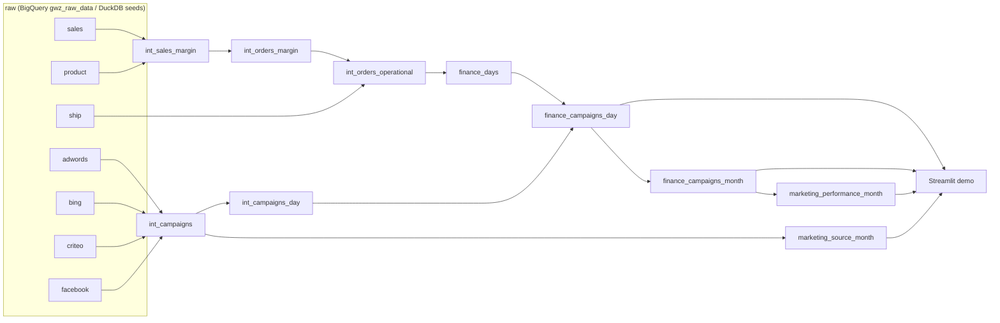

# Greenweez Finance and Campaign Analytics

dbt project that models transactional finance data together with paid-campaign data, so margin, logistics costs and advertising impact can be read from one reporting layer. It runs on **BigQuery** (the real warehouse) and on **DuckDB** (synthetic seed data, used by CI and the local demo).

## Business framing

- How much operational margin is generated after logistics costs?
- How does ad spend affect daily and monthly profitability?
- Which reporting models connect revenue, cost and campaign performance cleanly?

## Architecture



| Layer | Models | Materialization |
|---|---|---|
| staging | `stg_raw__sales`, `__product`, `__ship`, `__adwords`, `__bing`, `__criteo`, `__facebook` | view |
| intermediate | `int_sales_margin`, `int_orders_margin`, `int_orders_operational`, `int_campaigns`, `int_campaigns_day` | view |
| mart (`<dataset>_finance`) | `finance_days`, `finance_campaigns_day` (view), `finance_campaigns_month` | table |
| mart (`<dataset>_marketing`) | `marketing_performance_month`, `marketing_source_month` | table |

Key metric definitions:

- `operational_margin = margin + shipping_fee - log_cost - ship_cost`. Missing shipping records count as 0 (flagged by `has_ship_record`), so an order never drops out of the totals.
- `ads_margin = operational_margin - ads_cost`. Days with ad spend but no orders are kept and show a negative margin.
- Monthly `average_basket` is weighted (`sum(revenue) / sum(transactions)`), not an average of daily averages.
- Marketing efficiency (`marketing_performance_month`, `marketing_source_month`): `roas = revenue / ads_cost`, `margin_roas = operational_margin / ads_cost`, `cpc = ads_cost / clicks`, `ctr = clicks / impressions` (a 0-1 ratio). All are ratios of sums, and a zero denominator gives NULL.
- ROAS exists only at the **blended** level (all sources together). Revenue is not attributed to a source or campaign in the data, so per-source ROAS is deliberately not computed; per-source models carry CPC, CTR and spend share only.

## Quick start (DuckDB demo, no cloud account needed)

```bash
make setup     # pip install -r requirements.txt && dbt deps
make build     # dbt seed + dbt build (models, tests, unit tests) -> target/demo.duckdb
make demo      # Streamlit dashboard on top of the marts
make docs      # dbt docs (lineage incl. the dashboard exposure)
make lint      # sqlfluff + yamllint
make build-gsheet  # same pipeline on the Google Sheets export shape (synthetic seeds)
make demo-gsheet   # dashboard on that synthetic copy
make demo-gsheet-real  # dashboard on the real Google Sheets data (see below)
```

`scripts/generate_seed_data.py` regenerates the synthetic raw tables in `seeds/` (deterministic). It deliberately includes edge cases: orders without a shipping row, a sold product missing from the product table, days with ad spend but no orders. The two `WARN` results in `dbt build` come from these cases on purpose.

Note: dbt sources do not create DAG edges to seeds, so load them first (`dbt seed`) and then `dbt build --exclude resource_type:seed`; `make build` does this.

## Source systems: `gwz_raw` (default) and `fvt_gsheet`

The intermediate layer can be fed by two raw systems, selected with the `source_system` variable:

| | `gwz_raw` (default) | `fvt_gsheet` |
|---|---|---|
| Raw data | `gwz_raw_data.raw_gz_*` (order lines, products, 4 ad platforms) | `fvt_gsheet.gwz_finance_*` (Google Sheets export via Fivetran, order level) |
| Staging | `stg_raw__*` | `stg_gsheet__orders`, `__shipping`, `__refund`, `__campaign` |
| Available | everything | revenue, purchase cost, shipping fee/costs, daily ad cost, blended ROAS, separate refund report |
| Not available | | quantity (NULL), per-source ads, CPC/CTR (NULL), `marketing_source_month` |

```bash
make build-gsheet   # synthetic seeds on DuckDB
dbt build --vars '{source_system: fvt_gsheet}' --selector fvt_gsheet --indirect-selection cautious --exclude resource_type:seed   # real BigQuery data
```

Notes on the Google Sheets export (2021-10-01 to 2021-10-15, 13,362 orders, one row per order in orders, shipping and refund):

- **Refunds** (`stg_gsheet__refund`, `finance_refunds_month`): in general a refund is money returned to the customer, but the sheet's `refund` column does not behave like that. It has a value on every order (13,362 of 13,362), spread evenly between 50 and 500 whatever the order size (average about 274 in every order-size quartile, while average revenue goes from 23 to 143), it totals 3,668,193 (3.8 times the 967,261 revenue) and exceeds the order revenue on 12,426 orders. Read in cents it would be 36,681.93 (3.79% of revenue), but it would still be on every order. So it is **reported on its own and never subtracted from revenue or any margin**: `finance_refunds_month` (fvt_gsheet mode only) shows it as stored, how many orders have a refund and how many have a refund above their revenue, and `net_revenue_after_refunds` is NULL. Once its meaning and unit are confirmed, build with `--vars '{refund_amount_scale: 0.01, refund_unit_verified: true}'` (use the right scale) to get net revenue; the dashboard shows it then. A `warn` test (`assert_gsheet_refund_not_above_revenue`) keeps the anomaly visible.
- 13 orders have zero revenue, 43 have a negative margin and 561 have a zero purchase cost; they are kept, not filtered.
- It is a static snapshot, so no freshness check is configured.
- Result on the real data (checked against independent BigQuery sums): revenue 967,261.07, operational margin 210,572.49, ad cost 65,845.09, margin after ads 144,727.40, blended ROAS 14.69, margin ROAS 3.20.

## Dashboard

`demo/app.py` (Streamlit) reads a built DuckDB file and adapts to what the data contains: with per-source ads it shows spend by source, CPC and CTR; on the Google Sheets export it hides those sections and says why. Blended ROAS and margin ROAS show in both.

| Command | Data |
|---|---|
| `make demo` | synthetic default-mode data (`gwz_raw` shape) |
| `make demo-gsheet` | synthetic copy of the Google Sheets export |
| `make demo-gsheet-real` | the real Google Sheets data: `scripts/load_gsheet_from_bigquery.py` copies the four `fvt_gsheet` tables from BigQuery into `target/gsheet_real.duckdb` (read-only `SELECT`s, needs `GOOGLE_APPLICATION_CREDENTIALS`), then dbt builds the marts on it |

The real data is business data: it stays under `target/` (gitignored), never commit it, and keep the service-account key file out of the repository. `demo/smoke_test.py` runs the app headlessly in both modes and is part of CI.

## Running against BigQuery

1. Copy `.github/dbt-profiles/profiles.bigquery.example.yml` to `~/.dbt/profiles.yml` and set your project/dataset.
2. `dbt deps && dbt build`. Seeds are disabled on the BigQuery target; sources resolve to `workintech-working.gwz_raw_data.raw_gz_*`.
3. With dbt's default schema naming, staging/intermediate land in `<dataset>` and the marts in `<dataset>_finance` (e.g. `dbt_scetin` and `dbt_scetin_finance`).

The BigQuery target parses without credentials, but CI does not execute it (that needs a service account). Both source modes were also checked on BigQuery (EU): the default mode with the synthetic seeds, the `fvt_gsheet` mode with the real sheet data. The compiled model chain ran as a read-only query and returned the same numbers as DuckDB.

> The `gwz_raw_data.raw_gz_*` source tables must exist before a real BigQuery run; at the time of writing the dataset is empty.

## Quality checks (CI)

`.github/workflows/ci.yml` runs on every PR: `yamllint`, `sqlfluff lint`, `dbt deps`, `dbt seed`, `dbt build` on DuckDB (default mode, then the `fvt_gsheet` mode), which runs the schema tests, the singular reconciliation tests in `tests/` and the unit tests, and uploads the dbt docs as an artifact.

## Layout

```
models/{staging,intermediate,mart/finance}   dbt models + schema.yml docs/tests
models/staging/gsheet/                       staging for the fvt_gsheet export
models/mart/finance/finance_refunds_month.sql  refund report (fvt_gsheet mode only)
models/mart/marketing/                       ROAS / CPC / CTR marts
models/exposures.yml                         dashboard exposure
macros/                                      stg_ads_source, month_start
seeds/                                       synthetic raw_gz_* CSVs (DuckDB targets only)
tests/                                       singular reconciliation tests
demo/app.py                                  Streamlit dashboard (reads a built DuckDB file)
demo/smoke_test.py                           headless dashboard check, both source modes
scripts/load_gsheet_from_bigquery.py         read-only copy of fvt_gsheet into DuckDB
scripts/generate_seed_data.py                seed generator
```

## Limitations

- The demo data is synthetic; its numbers say nothing about the real Greenweez business.
- Campaign performance is reporting logic, not production marketing attribution.
- The dashboard is a demo, not a BI product; on the Google Sheets export it covers one month and no per-source ads.
- BigQuery execution is not part of CI, and the real `raw_gz_*` source tables are not loaded in the warehouse yet.

## License

MIT
